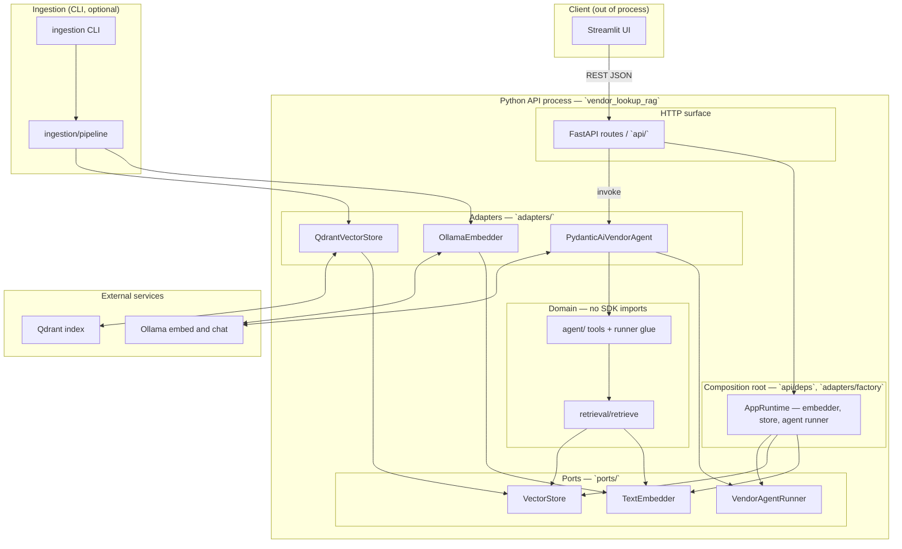
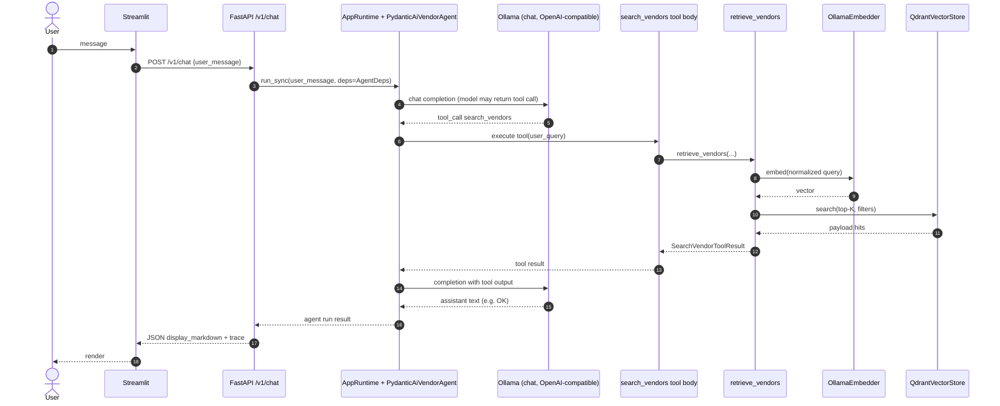
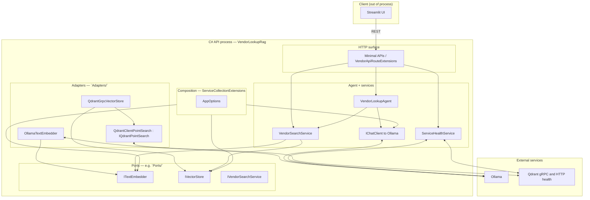
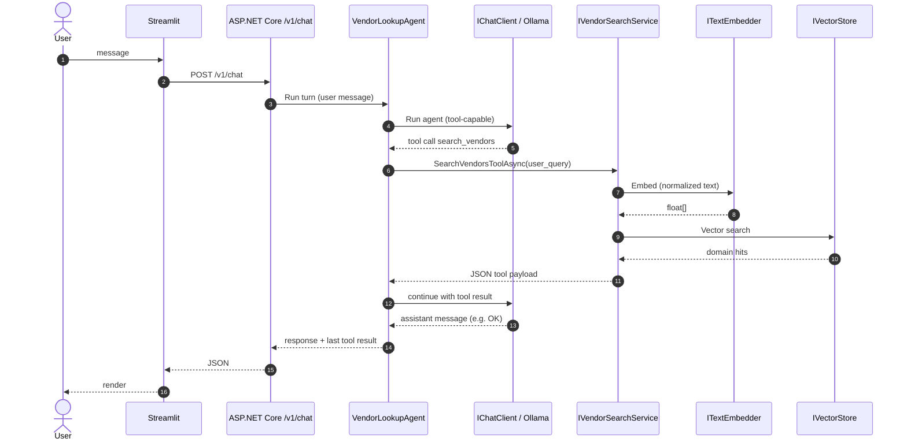

# Architecture

This document describes how the **Vendor Lookup RAG** system is put together: shared goals, the **ports and adapters** (hexagonal) style used in both backends, and **separate** views for the **Python** and **C#** API implementations. Operational setup (Docker, env vars, run order) lives in the repository **[README.md](../README.md)** and **[deploy-and-run.md](deploy-and-run.md)**. How to add or swap concrete implementations is in **[adapter-switching.md](adapter-switching.md)**.

---

## 1. Executive overview

The product is a **local-first** pipeline: users chat in a **Streamlit** app that calls a **single vendor HTTP API** contract (`GET /v1/health`, `GET /v1/status`, `POST /v1/chat`). That API can be served by **either** a **Python (FastAPI)** process or a **C# (ASP.NET Core)** process. Both talk to the same off-the-shelf infrastructure: **Ollama** (embedding + chat) and **Qdrant** (vector index). A **Python-only** ingestion path loads a vendor CSV, embeds rows, and upserts into Qdrant; both API stacks read the same collection for retrieval.

At the center of each backend is a small **domain-facing surface** (protocols in Python, interfaces in C#) that does **not** import vendor SDKs. Concretions—Ollama HTTP clients, Qdrant clients, and the agent/chat runtime—live in **adapters** and are **wired in one place** per process (the **composition root**). That split is the **Adapter pattern** applied in a **hexagonal** way:

- **Ports** answer *what* the application needs: “embed this text,” “search vectors,” “run one agent turn,” “describe vendor search for the model.”
- **Adapters** answer *how*: Ollama’s embed API, Qdrant’s wire protocol, Pydantic AI or Microsoft’s agent/AI abstractions, test fakes, or future alternates (another vector DB, another embedder) without rewriting retrieval or route handlers.

This yields **meaningful abstractions**: retrieval and tool logic depend on stable contracts; only adapters change when a library or network boundary changes. Tests can substitute **fakes** that implement the same ports, so domain behavior is testable without live Ollama or Qdrant.

The sections below give **one component diagram and one sequence diagram per backend** so you can see both the static structure and a typical request path in isolation.

---

## 2. Python backend (FastAPI + Pydantic AI)

### 2.1 How adapters and ports are used

| Port (protocol) | Role | Default adapter |
|-----------------|------|-----------------|
| `TextEmbedder` | Turn text into a dense vector for search | `OllamaEmbedder` (HTTP to Ollama) |
| `VectorStore` | Nearest-neighbor search + payload mapping | `QdrantVectorStore` (`qdrant-client`) |
| `VendorAgentRunner` | One synchronous agent run (user message in, structured result out) | `PydanticAiVendorAgent` (Pydantic AI + tool loop) |

`AgentDeps` bundles the embedder and store for the agent and the **retrieval** path (`retrieve_vendors`, `search_vendors` tool). **Composition** happens in the API layer: e.g. `open_vector_store`, `make_text_embedder`, and `build_production_runtime` in `api/deps.py` build a runtime object passed into FastAPI lifespan and route handlers. The **ingestion** CLI reuses the same factory helpers so ingest and API agree on how they talk to Qdrant and Ollama. Domain modules under `retrieval/`, `agent/`, and `matching/` depend only on **ports and models**, not on FastAPI or SDK types.

### 2.2 Component diagram (Python)

### 2.3 Sequence diagram (Python) — `POST /v1/chat` happy path

---

## 3. C# backend (ASP.NET Core + Microsoft.Agents.AI)

### 3.1 How adapters and ports are used

| Interface | Role | Default adapter / decoration |
|-----------|------|------------------------------|
| `ITextEmbedder` | Text → embedding vector for search | `OllamaTextEmbedder` (dedicated `HttpClient` to Ollama) |
| `IVectorStore` | Vector search and mapping to domain models | `QdrantGrpcVectorStore` (Qdrant **.NET** client over gRPC) |
| `IQdrantPointSearch` | Narrow gRPC “search points” surface | `QdrantClientPointSearch` — makes the store testable with a fake |
| `IChatClient` | Chat / tool loop against Ollama | Created by `OllamaChatClientFactory` (Microsoft.Extensions.AI–friendly client) |
| `IVendorSearchService` | Orchestrates embed + store + model types for the tool | `VendorSearchService` (domain-shaped API for the agent) |
| N/A (agent) | Wires `IChatClient` + tool | `VendorLookupAgent` (Microsoft.Agents.AI / `AsAIAgent`, `AIFunctionFactory` for `search_vendors`) |

`AddVendorLookupRagCore` in `Composition/ServiceCollectionExtensions.cs` is the **single composition root**: it registers `AppOptions`, HTTP clients, Qdrant client, vector store, search service, `VendorLookupAgent`, and `ServiceHealthService`. Route mapping in `Api/VendorApiRouteExtensions.cs` only resolves these services; it does not new-up SDKs. The **Adapter pattern** here means swapping Ollama or Qdrant means new classes implementing the same interfaces and a change in DI registration—not changes to minimal APIs for `/v1/chat`.

### 3.2 Component diagram (C#)

### 3.3 Sequence diagram (C#) — `POST /v1/chat` happy path

---

## 4. Cross-cutting notes

- **One REST contract, two runtimes:** Streamlit and tests target the same paths and JSON shapes; differences in OpenAPI **document** (Python exposes `/docs`, C# uses `/swagger`) are intentional—behavior is aligned by spec and tests, not a shared OpenAPI file (see [openapi.json](openapi.json) for the Python-exported contract).
- **Ingestion:** only the **Python** package implements `vendor-ingest`; the C# API still **reads** the same Qdrant collection and embedding settings so either API can answer after a Python-led ingest.
- **Observability:** both stacks can log and (optionally) trace; details are in code under `observability/` (Python) and standard ASP.NET Core logging (C#).

This architecture keeps **business rules and retrieval** stable while **infrastructure and LLM runtimes** evolve behind explicit ports and adapters.
