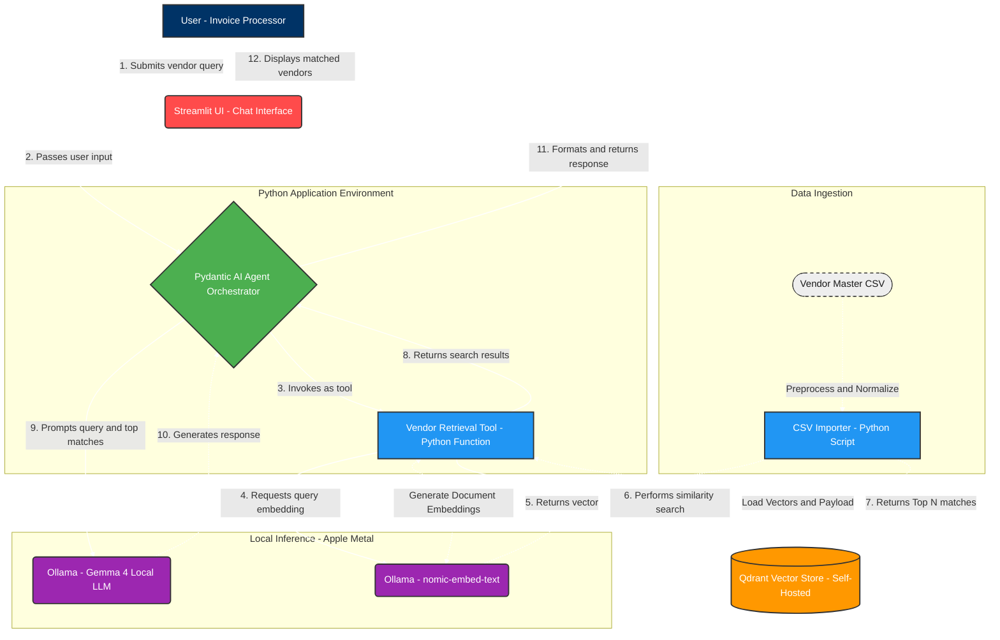

# Vendor Lookup Agent Architecture

## 1. System overview

The Vendor Lookup Agent is a modular, local-first RAG (Retrieval-Augmented Generation) pipeline. It orchestrates the flow of data from user input through a Streamlit UI to vector search and final LLM synthesis, ensuring fast and accurate vendor matching.

## 2. Core components

### A. CSV importer (data pipeline)

* **Function:** One-time (or batch) ingestion process.
* **Action:** Reads the raw vendor master CSV, applies lightweight text normalization (lowercasing, punctuation removal), generates vector embeddings via Ollama, and inserts the records into the Qdrant vector store.

### B. Vector store (Qdrant)

* **Function:** Scalable similarity search engine.
* **Action:** Stores preprocessed vendor records as vector embeddings. Executes high-speed nearest-neighbor searches based on the query vectors it receives from the retrieval tool.

### C. Vendor lookup agent (orchestration layer)

* **Function:** The central orchestration layer, built using Pydantic AI.
* **Action:** (1) Receives natural language queries containing vendor details from the user. (2) Determines if the input requires clarification or is ready for search. (3) Invokes the vendor retrieval tool. (4) Evaluates the search results (exact, partial, or no match). (5) Formats the final response for the user.

### D. Vendor retrieval tool (tool execution)

* **Function:** The Python tool invoked by the Pydantic AI agent to interface with retrieval.
* **Action:** Normalizes the user's input, converts it into an embedding via Ollama, and queries Qdrant to return the top *N* vendor matches.

### E. LLM engine (Ollama chat model)

* **Function:** Local inference engine.
* **Action:** Powers the reasoning capabilities of the agent, processing the context retrieved from Qdrant and generating the human-readable conversational output.

### F. User interface (Streamlit)

* **Function:** The front-end conversational interface.
* **Action:** Captures user queries using `st.chat_input` and renders the agent output using `st.chat_message`.

## 3. High-level execution flow

1. **Submit:** The user submits a vendor query through the Streamlit chat interface.
2. **Process and route:** The Pydantic AI agent receives the input and invokes the vendor retrieval tool.
3. **Embed and search:** The retrieval tool embeds the query and performs a vector similarity search on Qdrant.
4. **Retrieve:** Qdrant returns the top *N* candidate records.
5. **Analyze:** The agent analyzes the candidates alongside the original query using the chat LLM.
6. **Respond:** The agent formats the result (exact, partial, or no match) and Streamlit renders the final vendor details or suggestions to the user.

## 4. Solution architecture diagram

