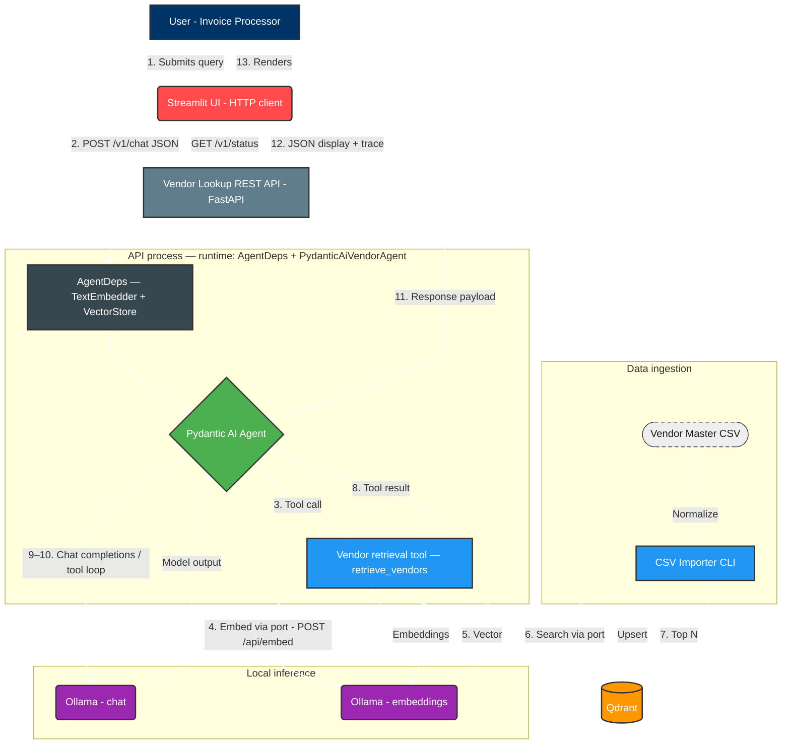
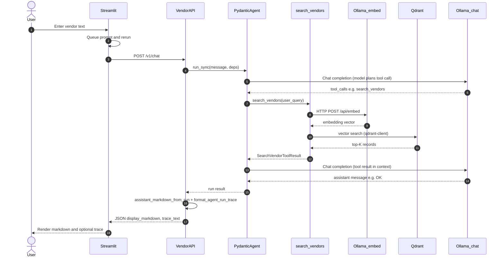

# Vendor Lookup Agent Architecture

## 1. System overview

The Vendor Lookup Agent is a modular, local-first RAG (Retrieval-Augmented Generation) pipeline. The **Streamlit** UI is a thin **HTTP client** to a **FastAPI** service that hosts the Pydantic AI agent, retrieval tool, and connections to **Ollama** and **Qdrant**. This keeps inference and vector search behind a stable REST surface while preserving the same chat behavior as the former in-process design.

Domain code depends on **ports** (`TextEmbedder`, `VectorStore`, `VendorAgentRunner`); **adapters** wire the defaults (**Ollama** HTTP embeddings, **Qdrant** via `qdrant-client`, **Pydantic AI** runner wrapping chat). Factories and `build_production_runtime()` in the API layer compose them. See **[adapter-switching.md](adapter-switching.md)** for swapping implementations.

**Operations:** Run order (Ollama and Qdrant up, then the vendor API, then Streamlit), Docker Compose layout, health scripts, and environment variables for local development and integration tests are described in the repository **[README.md](../README.md)**.

## 2. Core components

### A. CSV importer (data pipeline)

* **Function:** One-time (or batch) ingestion process.
* **Action:** Reads the raw vendor master CSV, applies lightweight text normalization (lowercasing, punctuation removal), generates vector embeddings via Ollama, and inserts the records into the Qdrant vector store.

### B. Vector store (Qdrant)

* **Function:** Scalable similarity search engine.
* **Action:** Stores preprocessed vendor records as vector embeddings. Executes high-speed nearest-neighbor searches based on the query vectors it receives from the retrieval tool (via the API process).

### C. Vendor lookup REST API (FastAPI)

* **Function:** Thin HTTP layer exposing chat, status, and machine-readable API metadata.
* **Action:** Builds `AgentDeps` (embedder + vector store), runs `VendorAgentRunner.run_sync`, and returns pre-rendered markdown and trace text. Exposes **GET `/v1/health`** (Ollama/Qdrant only), **GET `/v1/status`** (health plus model and threshold metadata for the Streamlit sidebar), and **POST `/v1/chat`**. **OpenAPI 3.x** is served at **`GET /openapi.json`** with **Swagger UI** at **`GET /docs`**; a copy of the spec is also kept at **[openapi.json](openapi.json)** for review and CI.

### D. Vendor lookup agent (orchestration layer)

* **Function:** The central orchestration layer, built using Pydantic AI (runs inside the API process).
* **Action:** (1) Receives natural language queries containing vendor details. (2) Invokes the vendor retrieval tool. (3) Evaluates the search results (exact, partial, or no match). (4) Returns structured tool output; the API maps that to display strings.

### E. Vendor retrieval tool (tool execution)

* **Function:** The Python tool invoked by the Pydantic AI agent to interface with retrieval (`search_vendors` → `search_vendors_tool_body`).
* **Action:** Normalizes the user's input, calls `retrieve_vendors` using the injected **`TextEmbedder`** and **`VectorStore`** ports (default adapters: Ollama embeddings + Qdrant search), classifies hits, and returns structured **`SearchVendorToolResult`** data for the API to render.

### F. LLM engine (Ollama chat model)

* **Function:** Local inference engine.
* **Action:** Powers the agent (OpenAI-compatible HTTP to Ollama under the API process).

### G. User interface (Streamlit)

* **Function:** The front-end conversational interface.
* **Action:** Captures user queries using `st.chat_input`, calls **POST `/v1/chat`** for each turn, and renders responses using `st.chat_message`. Sidebar uses **GET `/v1/status`** (cached) instead of calling Ollama/Qdrant health checks directly.

## 3. High-level execution flow

1. **Submit:** The user submits a vendor query through the Streamlit chat interface.
2. **REST call:** Streamlit sends the message to the vendor API (**POST `/v1/chat`**).
3. **Process and route:** The Pydantic AI agent receives the input and invokes the vendor retrieval tool.
4. **Embed and search:** The retrieval tool embeds the query and performs a vector similarity search on Qdrant.
5. **Retrieve:** Qdrant returns the top *N* candidate records.
6. **Analyze:** The chat model runs against Ollama (OpenAI-compatible API); it issues a tool call, consumes the tool result, and may run another completion to finish the turn (e.g. assistant text `"OK"` per system prompt).
7. **Respond:** The API returns display markdown and trace text; Streamlit renders the vendor details or suggestions to the user.

## 4. Solution architecture diagram

Default adapters: **OllamaEmbedder** (embeddings) and **QdrantVectorStore** (index). The chat model uses **OpenAI-compatible** HTTP to Ollama inside the Pydantic AI adapter.

## 5. Sequence diagram (user query)

## 6. Protocol summary

| Path | Mechanism |
|------|-----------|
| Streamlit to API | HTTP REST (JSON), `httpx` client (`GET /v1/status`, `POST /v1/chat`) |
| Browser or tooling to API | **OpenAPI 3.x** at `/openapi.json`, **Swagger UI** at `/docs` |
| API to Ollama | HTTP (embed + OpenAI-compatible chat) |
| API to Qdrant | HTTP via `qdrant-client` |
| Ingestion CLI to Ollama/Qdrant | Same HTTP stacks as above (no Streamlit) |
