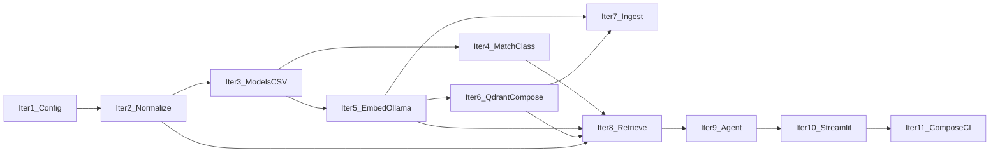

# Implementation iterations (TDD) and `plan.md`

## Scope and principles

- **Source of truth:** Spec ([vendor-lookup-agent-specifications.md](vendor-lookup-agent-specifications.md)) and [architecture.md](../docs/architecture.md).
- **Each iteration:** Small, **independently testable** slice. **Red → green → refactor**; extend the spec with anchors and `@pytest.mark.spec(...)` as behaviors are added.
- **Security baselines:** [security-notes.md](../docs/security-notes.md) when adding deps (Pydantic AI ≥ 1.56.0, Streamlit ≥ 1.54.0, Qdrant **≥ 1.16.0** when Qdrant is introduced).

## Progressive infrastructure (explicit)

- **No requirement to run Docker or Ollama for early iterations.** Add **only what that iteration needs** so setup stays light.
- **Iteration 1–4:** **Unit tests only** for application code (plus config unit tests in iteration 1). No mandatory containers.
- **Ollama:** First required for **iteration 5** (embedding client). Document **local install + model pull** on the Mac (Metal); adding **Ollama to `docker-compose.yml`** is **optional** in iteration 5 or later if you prefer containerized inference.
- **Qdrant:** Introduce **`docker-compose.yml` with Qdrant** in **iteration 6** when the vector-store adapter is implemented and you want real DB integration tests. Image tag **≥ 1.16.0**.
- **Later iterations** (7–9) reuse the same stack; iteration 11 can add **Redis**, CI jobs, and a **full-stack compose profile** without blocking earlier work.
- **Vendor REST API:** The chat path is served by **FastAPI** in `vendor_lookup_rag.api` (wired after the agent exists). **Streamlit** only calls this API over HTTP (`VENDOR_LOOKUP_API_BASE_URL`). Compose runs **`api`** (port 8000) and **`app`** (Streamlit) alongside **Qdrant**; see [deploy-and-run.md](../docs/deploy-and-run.md).

### Ollama deployment: what “separate” means and what to recommend

**What it meant:** Ollama does **not** have to run inside the same `docker-compose` as Qdrant. The usual dev setup is **install Ollama on the host** (from [ollama.com](https://ollama.com)), run it as a local service, and set **`OLLAMA_BASE_URL`** for the **vendor API** process to `http://localhost:11434` (or the documented host/port). That is “separate” from Compose only in the sense of **process boundary**: Compose brings up **Qdrant**, the **vendor API**, and **Streamlit** (and optionally Redis); **Ollama runs next to Docker**, not inside it, unless you opt in.

| Approach | Pros | Cons |
| -------- | ---- | ---- |
| **Host Ollama (recommended default for Apple Silicon)** | Uses **Metal** as Ollama intends; matches upstream docs; simple `ollama pull <model>`; best local LLM latency on Mac. | One extra install step; contributors must install Ollama once per machine. |
| **Ollama in Docker Compose (optional profile)** | One `docker compose up` story; good for **Linux + NVIDIA** or **headless CI** (CPU). | On **macOS**, GPU/Metal in containers is **poor or unavailable**—inference is often slower or CPU-bound; heavier images. |
| **Hybrid (recommended for this repo)** | **Qdrant (+ optional Redis), vendor API, and Streamlit in Compose**; **Ollama on the host**—reproducible DB, split UI/API, fast inference on Mac. | `docker compose up` + install Ollama + pull models; chat needs API + UI (see Compose). |

**Recommendation for “others run this on their laptop”:**

1. [x] **Document as the default path:** Install **Ollama natively**, pull the embedding and chat models, then `docker compose up` for **Qdrant**, **vendor API**, and **Streamlit** (and Redis if used). List env vars (`OLLAMA_BASE_URL`, `QDRANT_URL`, `VENDOR_LOOKUP_API_BASE_URL`, etc.) in `.env.example`. _(Done: [README.md](../README.md), [.env.example](../.env.example), [deploy-and-run.md](../docs/deploy-and-run.md).)_
2. [ ] **Add an optional Compose `profile` (e.g. `ollama`)** for teams who want everything containerized—**with a README callout** that **Mac users should prefer host Ollama** for performance; Linux users may use either. _(Not implemented; optional follow-up.)_
3. [x] **CI:** Prefer **CPU Ollama in Docker** or **mock** for integration tests; do not assume Metal in CI. _(Done: default `pytest` is unit-only; integration tests skip without services.)_

---

## Testing strategy: not only unit tests

| Layer | Purpose | When it appears |
| ----- | ------- | --------------- |
| **Unit** | Pure logic, mocked HTTP/Qdrant | Iterations **1–11**; default `pytest`, no services. |
| **Integration (Qdrant)** | Real Qdrant over HTTP | From **iteration 6** onward (after Compose + adapter exist). |
| **Integration (Ollama)** | Real embedding/LLM HTTP | From **iteration 5** (embeddings); **iteration 9** for LLM if you add slow tests. Mark `@pytest.mark.requires_ollama`; skip if Ollama not installed. |
| **End-to-end / manual** | Full chat | **Iteration 10+** |

**Pytest markers (iteration 1):** register `integration` and `requires_ollama`; add **skip helpers** when the matching service is introduced (Qdrant helpers in iteration 6, Ollama already skippable in iteration 5).

**CI default:** unit-only job. Optional workflow: start **Qdrant** (and later **Ollama** if available in CI) for `pytest -m integration`.

**Philosophy:** Unit tests always; integration tests against **real** services **when that iteration adds the dependency**, not before.

---

## Dependency order (high level)

---

## Iteration 1 — Configuration and pinned dependencies

- **Status:** [x] **Complete**
- [x] **Goal:** Settings (`pydantic-settings` or equivalent): reserve env vars for Ollama and Qdrant URLs even if unused until later iterations.
- [x] **Tests — unit:** Load defaults; invalid env fails clearly.
- [x] **Infra:** **None.** Register pytest markers `integration` and `requires_ollama` in [pyproject.toml](../pyproject.toml) for future use.
- [x] **Delivers:** [`config/settings.py`](../backend/python/src/config/settings.py), updated [pyproject.toml](../pyproject.toml).

## Iteration 2 — Text normalization (pure functions)

- **Status:** [x] **Complete**
- [x] **Goal:** Query + CSV-oriented normalization per spec.
- [x] **Tests:** **Unit only.**
- [x] **Delivers:** [`normalization/text.py`](../backend/python/src/normalization/text.py) + tests.

## Iteration 3 — Vendor domain model and CSV loading

- **Status:** [x] **Complete**
- [x] **Goal:** Parse **vendor master CSV** → `VendorRecord`.
- [x] **Tests:** **Unit only** — `tests/fixtures/`.
- [x] **Delivers:** [`models/records.py`](../backend/python/src/models/records.py), [`csv/`](../backend/python/src/csv/) (loader + mapping).

## Iteration 4 — Match classification (pure logic)

- **Status:** [x] **Complete**
- [x] **Goal:** Exact / Partial / No match mapping.
- [x] **Tests:** **Unit only.**
- [x] **Delivers:** [`matching/classify.py`](../backend/python/src/matching/classify.py) + tests.

## Iteration 5 — Ollama embedding client (**first Ollama contact**)

- **Status:** [x] **Complete**
- [x] **Goal:** HTTP client for embeddings; abstraction for tests.
- [x] **Tests — unit:** Mock HTTP.
- [x] **Tests — integration:** `@pytest.mark.requires_ollama` — optional real call when Ollama is running and model is pulled; **skip** otherwise (document `ollama pull …`).
- [x] **Infra:** **Default = host Ollama** documented in README / `.env.example`. 
- [ ] **Optional:** Compose `profile` for Ollama (still open — same as §Ollama recommendation 2).
- [x] **Delivers:** [`embedding/ollama.py`](../backend/python/src/embedding/ollama.py).

## Iteration 6 — Qdrant vector store (**first Docker Compose for Qdrant**)

- **Status:** [x] **Complete**
- [x] **Goal:** `docker-compose.yml` with **Qdrant** (image **≥ 1.16.0**). Collection schema, upsert, search; thin wrapper over `qdrant-client`.
- [x] **Tests — unit:** In-memory Qdrant (`:memory:`) + mocks where applicable.
- [x] **Tests — integration:** Real Qdrant optional; `tests/conftest.py` skip if `QDRANT_URL` unreachable; [`integration/test_qdrant_optional.py`](../tests/integration/test_qdrant_optional.py).
- [x] **Delivers:** [`vector/store.py`](../backend/python/src/vector/store.py), [`docker-compose.yml`](../docker-compose.yml).

## Iteration 7 — Ingestion pipeline (CSV → embeddings → Qdrant)

- **Status:** [x] **Complete**
- [x] **Goal:** CLI ingest.
- [x] **Tests — unit:** Mocks.
- [x] **Tests — integration:** Full path when Ollama + Qdrant are up (otherwise skip) — covered by markers / manual runs; no dedicated automated E2E ingest test required by plan.
- [x] **Delivers:** [`ingestion/pipeline.py`](../backend/python/src/ingestion/pipeline.py), [`ingestion/cli.py`](../backend/python/src/ingestion/cli.py), `vendor-ingest` entry in [pyproject.toml](../pyproject.toml).

## Iteration 8 — Vendor retrieval tool

- **Status:** [x] **Complete**
- [x] **Goal:** Normalize → embed → search.
- [x] **Tests — unit:** Mocks; optional integration when services up.
- [x] **Delivers:** [`retrieval/retrieve.py`](../backend/python/src/retrieval/retrieve.py).

## Iteration 9 — Pydantic AI agent + LLM (Ollama)

- **Status:** [x] **Complete**
- [x] **Goal:** Agent + tool + LLM.
- [x] **Tests — unit:** Import / wiring smoke ([`agent/test_runner.py`](../tests/agent/test_runner.py)).
- [x] **Tests — integration (optional):** Real Ollama LLM + Qdrant end-to-end — not automated (manual / nightly possible).
- [x] **Delivers:** [`agent/runner.py`](../backend/python/src/agent/runner.py).

## Iteration 10 — Streamlit chat UI (HTTP client)

- **Status:** [x] **Complete**
- [x] **Goal:** Chat UI calling the vendor REST API over HTTP (no in-process agent).
- [x] **Tests:** Smoke import ([`agent/test_runner.py`](../tests/agent/test_runner.py)); Streamlit AppTest; [`tests/api/test_api.py`](../tests/api/test_api.py); [`tests/ui/test_api_client.py`](../tests/ui/test_api_client.py) (httpx).
- [x] **Delivers:** [`api/`](../backend/python/src/api/) (FastAPI), [`ui/app.py`](../backend/python/src/ui/app.py), [`ui/api_client.py`](../backend/python/src/ui/api_client.py), [`app.py`](../backend/python/src/app.py) (shim), [README.md](../README.md).

## Iteration 11 — Compose polish, CI, runbook

- **Status:** [x] **Complete** (required items); optional items tracked below
- [ ] Optional **Redis** in Compose — not added (optional per plan).
- [ ] Optional **Ollama Compose profile** — not added (optional per plan; host Ollama documented).
- [x] [.env.example](../.env.example) with env vars.
- [x] CI workflow: [.github/workflows/vendor-lookup-rag-ci.yml](../.github/workflows/vendor-lookup-rag-ci.yml) (unit `pytest` and Qdrant integration on push/PR).
- [x] [README.md](../README.md) runbook: host Ollama + `docker compose` for Qdrant, vendor API, and Streamlit ([deploy-and-run.md](../docs/deploy-and-run.md)).

---

## Artifact: `plan.md`

- [x] Added **[plan.md](../plan.md)** with structure, exit criteria, and tracking table.

## Optional cleanup (non-blocking)

- [x] [architecture.md](../docs/architecture.md) — client–server REST layout, diagrams, and protocol summary (replaces older single-process Streamlit diagram).
