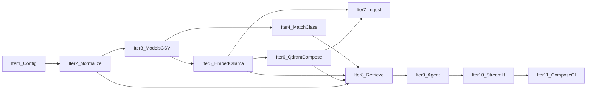

# Implementation iterations (TDD)

## Scope and principles

- **Source of truth:** [vendor-lookup-agent-specifications.md](vendor-lookup-agent-specifications.md) and [architecture.md](../docs/architecture.md).
- **Each iteration:** Small, **independently testable** slice. **Red → green → refactor**; extend the spec with anchors and `@pytest.mark.spec(...)` as behaviors are added.
- **Security baselines:** [security-notes.md](../docs/security-notes.md) when adding deps (Pydantic AI ≥ 1.56.0, Streamlit ≥ 1.54.0, Qdrant / client versions per `backend/python/pyproject.toml` when Qdrant is introduced).
- **Path convention (this doc):** Python source and tests are under `backend/python/`; links below use paths **relative to this `specs/` file**.

## Progressive infrastructure (explicit)

- **No requirement to run Docker or Ollama for early iterations.** Add **only what that iteration needs** so setup stays light.
- **Iteration 1–4:** **Unit tests only** for application code (plus config unit tests in iteration 1). No mandatory containers.
- **Ollama:** First required for **iteration 5** (embedding client). Document **local install + model pull** on the Mac (Metal); adding **Ollama to `docker-compose.yml`** is **optional** in iteration 5 or later if you prefer containerized inference.
- **Qdrant:** Introduce **`docker-compose.yml` with Qdrant** in **iteration 6** when the vector-store adapter is implemented and you want real DB integration tests. Use a Qdrant image tag **aligned with the repo** (e.g. **≥ 1.16.0**; see [docker-compose.yml](../docker-compose.yml)).
- **Later iterations** (7–9) reuse the same stack; iteration 11 can add **Redis**, CI jobs, and a **full-stack compose profile** without blocking earlier work. **Redis** remains unimplemented (optional).
- **Vendor HTTP API (Python):** The chat path is served by **FastAPI** in `vendor_lookup_rag.api` (wired after the agent exists). **Streamlit** only calls this API over HTTP (`VENDOR_LOOKUP_API_BASE_URL` when using the default Python stack on port 8000). Compose runs **`api`** (port 8000) and **`app`** (Streamlit) alongside **Qdrant**; see [deploy-and-run.md](../docs/deploy-and-run.md).
- **Alternate C# API (post plan):** A second implementation under `backend/csharp/` serves the same `/v1/*` contract on **port 8001** by default; use [`docker-compose.csharp.yml`](../docker-compose.csharp.yml). Ingestion remains **Python** (`vendor-ingest`).

### Ollama deployment: what “separate” means and what to recommend

**What it meant:** Ollama does **not** have to run inside the same `docker-compose` as Qdrant. The usual dev setup is **install Ollama on the host** (from [ollama.com](https://ollama.com)), run it as a local service, and set **`OLLAMA_BASE_URL`** for the **vendor API** process to `http://localhost:11434` (or the documented host/port). That is “separate” from Compose only in the sense of **process boundary**: Compose brings up **Qdrant**, the **vendor API** (Python and/or C# in separate compose files), and **Streamlit**; **Ollama runs next to Docker**, not inside it, unless you opt in.

| Approach | Pros | Cons |
| -------- | ---- | ---- |
| **Host Ollama (recommended default for Apple Silicon)** | Uses **Metal** as Ollama intends; matches upstream docs; simple `ollama pull <model>`; best local LLM latency on Mac. | One extra install step; contributors must install Ollama once per machine. |
| **Ollama in Docker Compose (optional profile)** | One `docker compose up` story; good for **Linux + NVIDIA** or **headless CI** (CPU). | On **macOS**, GPU/Metal in containers is **poor or unavailable**—inference is often slower or CPU-bound; heavier images. |
| **Hybrid (recommended for this repo)** | **Qdrant, vendor API, and Streamlit in Compose**; **Ollama on the host**—reproducible DB, split UI/API, fast inference on Mac. | `docker compose up` + install Ollama + pull models; chat needs API + UI (see Compose). |

**Recommendation for “others run this on their laptop”:**

1. [x] **Document as the default path:** Install **Ollama natively**, pull the embedding and chat models, then `docker compose up` for **Qdrant**, **vendor API**, and **Streamlit** (and Redis if used). List env vars (`OLLAMA_BASE_URL`, `QDRANT_URL`, `VENDOR_LOOKUP_API_BASE_URL`, etc.) in `.env.example`. _(Done: [README.md](../README.md), [.env.example](../.env.example), [deploy-and-run.md](../docs/deploy-and-run.md).)_
2. [ ] **Add an optional Compose `profile` (e.g. `ollama`)** for teams who want everything containerized—**with a README callout** that **Mac users should prefer host Ollama** for performance; Linux users may use either. _(Not implemented; optional follow-up.)_
3. [x] **CI:** Prefer **mock** or optional services for Python integration tests; do not assume Metal in CI. C# **dotnet test** runs on Linux with **.NET 10** SDK. _(See [.github/workflows/vendor-lookup-rag-ci.yml](../.github/workflows/vendor-lookup-rag-ci.yml).)_

---

## Testing strategy: not only unit tests

| Layer | Purpose | When it appears |
| ----- | ------- | --------------- |
| **Unit (Python)** | Pure logic, mocked HTTP/Qdrant | Iterations **1–11**; default `pytest` from `backend/python/`, no services. |
| **Unit (C#)** | xUnit, fakes, in-process `WebApplicationFactory` | `dotnet test` on `backend/csharp/VendorLookupRag.sln` |
| **Integration (Qdrant, Python)** | Real Qdrant over HTTP | From **iteration 6** onward. CI job `test-integration-qdrant` starts Qdrant. |
| **Integration (Ollama, Python)** | Real embedding/LLM HTTP | From **iteration 5** (embeddings); **iteration 9** for LLM if you add slow tests. Mark `@pytest.mark.requires_ollama`; skip if Ollama not installed. |
| **End-to-end / manual** | Full chat | **Iteration 10+** |

**Pytest markers (iteration 1):** register `integration` and `requires_ollama` in [backend/python/pyproject.toml](../backend/python/pyproject.toml); add **skip helpers** in [backend/python/tests/conftest.py](../backend/python/tests/conftest.py) when the matching service is used.

**CI (current):** Python: install + `pytest`, OpenAPI JSON export and diff, optional Qdrant integration job. **C#:** `dotnet test` (Release), `VENDOR_LOOKUP_CSHARP_PORT=0`. No mandatory Ollama in CI for default PR checks.

**Philosophy:** Unit tests always; integration tests against **real** services **when that iteration adds the dependency**, not before.

---

## Dependency order (high level)



The **C# API** reuses the same data plane (Qdrant + Ollama) and does not change this ordered delivery for **Python** features.

---

## Iteration 1 — Configuration and pinned dependencies

- **Status:** [x] **Complete**
- [x] **Goal:** Settings (`pydantic-settings` or equivalent): reserve env vars for Ollama and Qdrant URLs even if unused until later iterations.
- [x] **Tests — unit:** Load defaults; invalid env fails clearly.
- [x] **Infra:** **None.** Register pytest markers `integration` and `requires_ollama` in [backend/python/pyproject.toml](../backend/python/pyproject.toml) for future use.
- [x] **Delivers:** [`config/settings.py`](../backend/python/src/config/settings.py), updated [pyproject.toml](../backend/python/pyproject.toml) (build: **setuptools**; **not** hatchling in current tree).

## Iteration 2 — Text normalization (pure functions)

- **Status:** [x] **Complete**
- [x] **Goal:** Query + CSV-oriented normalization per spec.
- [x] **Tests:** **Unit only.**
- [x] **Delivers:** [`normalization/text.py`](../backend/python/src/normalization/text.py) + tests under [backend/python/tests/](../backend/python/tests/).

## Iteration 3 — Vendor domain model and CSV loading

- **Status:** [x] **Complete**
- [x] **Goal:** Parse **vendor master CSV** → `VendorRecord`.
- [x] **Tests:** **Unit only** — [backend/python/tests/fixtures/](../backend/python/tests/fixtures/).
- [x] **Delivers:** [`models/records.py`](../backend/python/src/models/records.py), [`csv/`](../backend/python/src/csv/) (loader + mapping).

## Iteration 4 — Match classification (pure logic)

- **Status:** [x] **Complete**
- [x] **Goal:** Exact / Partial / No match mapping.
- [x] **Tests:** **Unit only.**
- [x] **Delivers:** [`matching/classify.py`](../backend/python/src/matching/classify.py) + tests.

## Iteration 5 — Ollama embedding client (**first Ollama contact**)

- **Status:** [x] **Complete**
- [x] **Goal:** HTTP client for embeddings; abstraction for tests.
- [x] **Tests — unit:** Mock HTTP.
- [x] **Tests — integration:** `@pytest.mark.requires_ollama` — optional real call when Ollama is running and model is pulled; **skip** otherwise (document `ollama pull …`).
- [x] **Infra:** **Default = host Ollama** documented in README / `.env.example`. 
- [ ] **Optional:** Compose `profile` for Ollama (still open — same as §Ollama recommendation 2).
- [x] **Delivers:** [`embedding/ollama.py`](../backend/python/src/embedding/ollama.py).

## Iteration 6 — Qdrant vector store (**first Docker Compose for Qdrant**)

- **Status:** [x] **Complete**
- [x] **Goal:** `docker-compose.yml` with **Qdrant**. Collection schema, upsert, search; adapter over `qdrant-client`.
- [x] **Tests — unit:** Fakes and `:memory:` / client tests as implemented.
- [x] **Tests — integration:** Real Qdrant optional; [backend/python/tests/conftest.py](../backend/python/tests/conftest.py) skip patterns; [integration/test_qdrant_optional.py](../backend/python/tests/integration/test_qdrant_optional.py).
- [x] **Delivers:** [`vector/store.py`](../backend/python/src/vector/store.py), [docker-compose.yml](../docker-compose.yml). (`VendorVectorStore` and related live under `adapters/`.)

## Iteration 7 — Ingestion pipeline (CSV → embeddings → Qdrant)

- **Status:** [x] **Complete**
- [x] **Goal:** CLI ingest.
- [x] **Tests — unit:** Mocks.
- [x] **Tests — integration:** Full path when Ollama + Qdrant are up (otherwise skip) — covered by markers / manual runs; no dedicated automated E2E ingest test required by plan.
- [x] **Delivers:** [`ingestion/pipeline.py`](../backend/python/src/ingestion/pipeline.py), [`ingestion/cli.py`](../backend/python/src/ingestion/cli.py), `vendor-ingest` entry in [pyproject.toml](../backend/python/pyproject.toml).

## Iteration 8 — Vendor retrieval tool

- **Status:** [x] **Complete**
- [x] **Goal:** Normalize → embed → search.
- [x] **Tests — unit:** Mocks; optional integration when services up.
- [x] **Delivers:** [`retrieval/retrieve.py`](../backend/python/src/retrieval/retrieve.py).

## Iteration 9 — Pydantic AI agent + LLM (Ollama)

- **Status:** [x] **Complete**
- [x] **Goal:** Agent + tool + LLM.
- [x] **Tests — unit:** Import / wiring smoke ([agent/test_runner.py](../backend/python/tests/agent/test_runner.py)).
- [x] **Tests — integration (optional):** Real Ollama LLM + Qdrant end-to-end — not automated in CI (manual / nightly possible).
- [x] **Delivers:** [`agent/runner.py`](../backend/python/src/agent/runner.py) (and related `agent/` modules, `adapters/pydantic_ai/`).

## Iteration 10 — Streamlit chat UI (HTTP client) + Python FastAPI

- **Status:** [x] **Complete**
- [x] **Goal:** Chat UI calling the vendor REST API over HTTP (no in-process agent in Streamlit). FastAPI app exposes the agent and routes.
- [x] **Tests:** [agent/test_runner.py](../backend/python/tests/agent/test_runner.py); [api/test_api.py](../backend/python/tests/api/test_api.py); [ui/test_api_client.py](../backend/python/tests/ui/test_api_client.py), [ui/test_app.py](../backend/python/tests/ui/test_app.py) (httpx + Streamlit paths against `vendor_lookup_streamlit`); OpenAPI test coverage under [api/](../backend/python/tests/api/).
- [x] **Delivers:**  
  - **API:** [`api/`](../backend/python/src/api/) (FastAPI), [`ui/chat_display.py`](../backend/python/src/ui/chat_display.py) (formatting API responses to markdown for JSON — *not* the Streamlit app).  
  - **Streamlit (separate installable tree):** [frontend/streamlit/](../frontend/streamlit/) — `app.py` and `api_client.py` live under `src/vendor_lookup_streamlit/`, not under `backend/python/src/ui/`.  
  - [README.md](../README.md) documents `streamlit run` and `VENDOR_LOOKUP_API_BASE_URL`.

## Iteration 11 — Compose polish, CI, runbook, C# on CI

- **Status:** [x] **Complete** (required items); optional items tracked below
- [ ] Optional **Redis** in Compose — not added (optional per plan).
- [ ] Optional **Ollama Compose profile** — not added (optional per plan; host Ollama documented).
- [x] [.env.example](../.env.example) with env vars.
- [x] **Python CI** — [vendor-lookup-rag-ci.yml](../.github/workflows/vendor-lookup-rag-ci.yml): `pip install -e ".[dev]"` in `backend/python/`, `pytest`, `vendor-api-openapi` to refresh [openapi.json](../docs/openapi.json), `git diff` check, **Qdrant** integration job for marked tests.
- [x] **C# CI** — same workflow: `dotnet test` on [VendorLookupRag.sln](../backend/csharp/VendorLookupRag.sln), **.NET 10** SDK, `VENDOR_LOOKUP_CSHARP_PORT=0`.
- [x] [README.md](../README.md) runbook: host Ollama + `docker compose` for Qdrant, **Python** `api` + `app`; [deploy-and-run.md](../docs/deploy-and-run.md) also documents the **C#** stack and alternate host ports (e.g. from [`docker-compose.csharp.yml`](../docker-compose.csharp.yml): Qdrant 6335, API 8001, Streamlit 8502).

---

## Iteration exit criteria (compact)

| # | Iteration | Exit criteria | Done |
|---|-----------|---------------|------|
| 1 | Config + deps + pytest markers | `Settings` + `get_settings()`; unit tests; markers registered | [x] |
| 2 | Text normalization | `normalize_text()`; table-driven unit tests | [x] |
| 3 | Vendor models + CSV | `VendorRecord`, `load_vendor_csv()`; fixture CSV tests | [x] |
| 4 | Match classification | `classify_matches()` exact/partial/none; unit tests | [x] |
| 5 | Ollama embeddings | `OllamaEmbedder`; `respx` unit tests; optional `@requires_ollama` | [x] |
| 6 | Qdrant adapter + Compose | `VendorVectorStore` / Qdrant vector store; `:memory:` and integration tests; `docker-compose.yml` (Qdrant image aligned with project) | [x] |
| 7 | Ingestion + CLI | `ingest_vendor_csv`, `vendor-ingest` script; mocked test | [x] |
| 8 | Retrieval | `retrieve_vendors()`; unit tests with mocks | [x] |
| 9 | Pydantic AI agent | `build_vendor_agent()` + `search_vendors` tool | [x] |
| 10 | Streamlit + vendor REST API | `vendor_lookup_rag.api` (FastAPI); Streamlit in `frontend/streamlit/`, calls `VENDOR_LOOKUP_API_BASE_URL`; `streamlit run …` | [x] |
| 11 | Compose + CI + runbook + C# on CI | `.env.example`, `api` + `app` in default compose, [`.github/workflows/vendor-lookup-rag-ci.yml`](../.github/workflows/vendor-lookup-rag-ci.yml) (Python + Qdrant integration + C# `dotnet test`), README | [x] |

## Commands (cheat sheet)

```bash
# From repository root unless noted. Create/activate a venv first; see README.
docker compose up -d          # Qdrant (+ api + app when using full compose)
cp .env.example .env          # adjust URLs/models
pip install -e "backend/python[dev]"
pip install -e "frontend/streamlit"
cd backend/python && pytest
cd backend/python && vendor-ingest path/to/vendors.csv
cd backend/python && vendor-api    # :8000; or: python -m vendor_lookup_rag.api
streamlit run frontend/streamlit/src/vendor_lookup_streamlit/app.py
# set VENDOR_LOOKUP_API_BASE_URL if the API is not the default
```

C# API (from repo root): `dotnet run --project backend/csharp/src` (default port **8001**). C# + Streamlit: [`docker-compose.csharp.yml`](../docker-compose.csharp.yml) and [deploy-and-run.md](../docs/deploy-and-run.md).

## CSV format (vendor master)

Required columns: `vendor_id`, `legal_name`. Optional: `city`, `postal_code` (or `zip`), `vat_id` (or `vat`), `country` (and other columns per loader mapping). Column mapping overrides: environment variables and optional JSON path as in **.env.example** and the root [README.md](../README.md).

## Spec-driven development (for contributors)

This project uses **SDD** alongside **TDD**: the *product* requirements and scenarios live only in [vendor-lookup-agent-specifications.md](vendor-lookup-agent-specifications.md) (no code or file paths there). This *plan* document and the code carry implementation detail.

**Typical workflow**

1. Extend the **product spec** with a requirement or scenario when behavior is agreed.
2. **Review**; confirm acceptance criteria.
3. **Red** — add a failing test (Python tests can use `@pytest.mark.spec("specs/vendor-lookup-agent-specifications.md#<anchor>")` so failures point to the spec).
4. **Green** — implement until tests pass.
5. **Refactor**; keep the spec and plan in sync if scope changes.

**Which document is which**

| Document | Role |
|----------|------|
| [vendor-lookup-agent-specifications.md](vendor-lookup-agent-specifications.md) | *What* we must deliver (FR/NFR, SHALL/MUST, scenarios). |
| *This file* (vendor-lookup-agent-plan) | *How* we delivered it in iterations, cheat sheet, links into the tree. |
| [architecture.md](../docs/architecture.md) | *How it is shaped* (ports, adapters, diagrams). |

## Optional cleanup (non-blocking)

- [x] [architecture.md](../docs/architecture.md) — **Python and C#** component and sequence diagrams, adapter pattern, REST overview. _(Updated.)_

---

*This plan is aligned with the current repository layout, dual backends, setuptools packaging, and CI as of the linked workflow version.*
